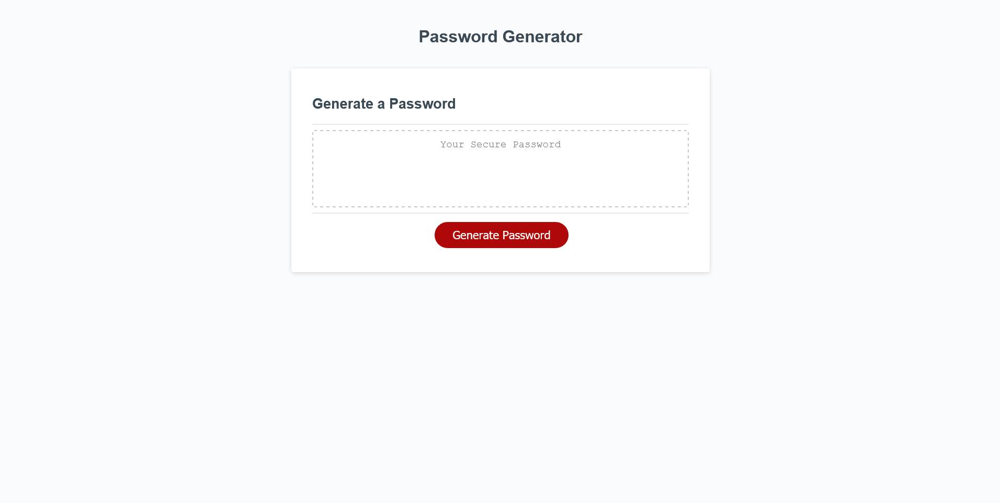

# Password Generator

This assignment required us to create a password generator application that would enable employees to generate random passwords based on their selected criteria. The application will run in the browser while being dynamically updated by the HTML & CSS while being powered by Javascript code that we have edited to function appropriately.

# User Story

AS AN employee with access to sensitive data
I WANT to randomly generate a password that meets certain criteria
SO THAT I can create a strong password that provides greater security

# Description

Password generators are crucial as they add extra assistance in protecting users by providing unique passwords for them to apply to their many logins on various browsers.

# Considerations

As I worked through the assignment, I had to think of unique possibilities that users may run into when creating their passwords. For example, do they want all uppercase but no lowercase? Numbers, but no special characters? Some may choose 1 out of 4 of the options, or maybe 3 out of 4 of the password generator options. Being open-minded and walking through the password generator ifs and else ifs was essential in developing the password generator.

# Updates

Listed alphabet, numbers, special characters, and added functions for upper case alphabet. Ensured there would be random variable selection and random selection for every variable. Also incorporated .push and spread operators to allow the if and variable choices to function cohesively.

# Acceptance Criteria

GIVEN I need a new, secure password
WHEN I click the button to generate a password
THEN I am presented with a series of prompts for password criteria
WHEN prompted for password criteria
THEN I select which criteria to include in the password
WHEN prompted for the length of the password
THEN I choose a length of at least 8 characters and no more than 128 characters
WHEN prompted for character types to include in the password
THEN I choose lowercase, uppercase, numeric, and/or special characters
WHEN I answer each prompt
THEN my input should be validated and at least one character type should be selected
WHEN all prompts are answered
THEN a password is generated that matches the selected criteria
WHEN the password is generated
THEN the password is either displayed in an alert or written to the page

# Contributors

Angelica Sargent

# Screenshot

# Link
Take a look at this [link] https://agraysargent.github.io/password-generator/